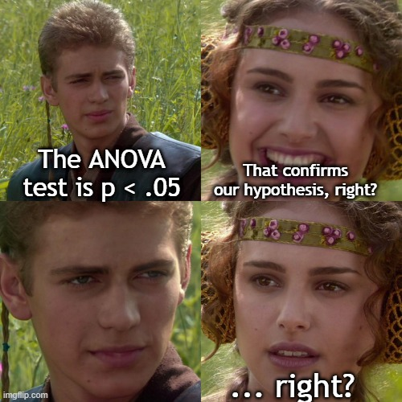
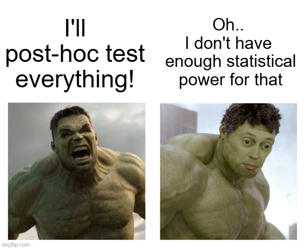

```{r setup, include=FALSE}
knitr::opts_chunk$set(
  echo    = TRUE,
  message = FALSE,
  warning = FALSE,
  fig.align = "center",
  fig.width = 7,
  fig.height = 4.5
)
```

```{r load-packages}
library(contrastanalysis)
library(MASS)
library(ggplot2)
```

# You Have a hypothesis. ANOVA Can't Test It.

Imagine you run an experiment. You randomly assign participants to four
conditions. You have a clear, specific prediction about what the results
should look like: you expect the dependent variable to increase steadily
from the first condition to the last.

So you collect your data, run an ANOVA, and get a significant *F*-test.
Great... right?

<center>
{width=60%}
</center>

Well..Not so fast! The ANOVA tells you that **at least two group means
are different**. That's it. It doesn't tell you whether they differ *in
the way you predicted*. Maybe the first three groups are flat and only
the last one jumps up. Maybe the pattern is U-shaped. Maybe it's
completely random. A significant *F* cannot distinguish between any of
these possibilities.

Let's make this concrete with a visualization.

```{r anova-problem-visual, echo=FALSE, fig.width=9, fig.height=4}
set.seed(1)

# Three very different patterns, all producing significant ANOVAs
patterns <- data.frame(
  Condition = rep(c("A", "B", "C", "D"), each = 40),
  Linear    = c(rnorm(40, 2, 2), rnorm(40, 4, 2), rnorm(40, 6, 2), rnorm(40, 8, 2)),
  Threshold = c(rnorm(40, 3, 2), rnorm(40, 3, 2), rnorm(40, 3, 2), rnorm(40, 8, 2)),
  UShaped   = c(rnorm(40, 7, 2), rnorm(40, 3, 2), rnorm(40, 3, 2), rnorm(40, 7, 2))
)

means_df <- data.frame(
  Condition = rep(c("A", "B", "C", "D"), 3),
  Score     = c(tapply(patterns$Linear, patterns$Condition, mean),
                tapply(patterns$Threshold, patterns$Condition, mean),
                tapply(patterns$UShaped, patterns$Condition, mean)),
  Pattern   = rep(c("Linear (your hypothesis)", "Threshold (not your hypothesis)",
                     "U-shaped (not your hypothesis)"), each = 4)
)

ggplot(means_df, aes(x = Condition, y = Score, group = 1)) +
  geom_line(linewidth = 1.2, color = "#2E75B6") +
  geom_point(size = 3, color = "#2E75B6") +
  facet_wrap(~Pattern, scales = "free_y") +
  labs(title = "Three Very Different Patterns — All Produce Significant ANOVAs",
       subtitle = "The F-test says 'something differs,' but cannot tell you which pattern is real",
       y = "Group Mean") +
  theme_minimal(base_size = 13) +
  theme(plot.title = element_text(face = "bold"),
        strip.text = element_text(face = "bold"))
```

In the figure above, the letters A, B, C, D represent four groups (e.g.,
four experimental conditions or four levels of a measured categorical
variable). The Y-axis is the outcome of interest. Imagine your
hypothesis is that the outcome mean should follow this pattern: A \< B
\< C \< D (i.e., A has the lowest mean and it gradually and linearly
increases from A to B, then from B to C, then from C to D).

The three panels represent three possible scenarios.

All three panels above would produce a statistically significant ANOVA.
But only the first one matches your hypothesis. The ANOVA treats all
three as the same outcome: "*p* \< .05, at least two means differ." It's
blind to shape.

This is the fundamental limitation of the omnibus *F*-test: **it's like
a fire alarm that tells you there's a fire somewhere in the building,
but it can't tell you which room**.

# Strategy 1: The Eyeballing Trap ("Just Look at the Means")

Faced with a significant ANOVA, many researchers simply look at the
group means and declare that the pattern matches their hypothesis. The
logic goes: "The ANOVA is significant, and the means *look like* they go
up, so my linear hypothesis is supported."

This sounds intuitive, but it is **statistically indefensible**. You
have not actually tested whether the pattern is linear. You have tested
whether *something* differs, and then you *assumed* it differed in the
way you expected. This is the difference between testing a hypothesis
and narrating one.

Let's see how badly this can go wrong with two detailed examples.

## Example A: The hidden plateau

A researcher predicts that increasing the difficulty of a cognitive task
(Low, Medium, Hard, Extreme) will produce a linear increase in response
time. The researcher runs the experiment with 50 participants per group.

```{r eyeball-example-A, echo=FALSE, fig.width=8, fig.height=5}
# First we simulate some data
set.seed(77)
n_ey <- 50

## True pattern: plateau at Medium and Hard, then jump at Extreme
plateau_data <- data.frame(
  difficulty = factor(rep(c("Low", "Medium", "Hard", "Extreme"), each = n_ey),
                      levels = c("Low", "Medium", "Hard", "Extreme")),
  rt = c(
    rnorm(n_ey, mean = 400, sd = 60),
    rnorm(n_ey, mean = 440, sd = 60),
    rnorm(n_ey, mean = 445, sd = 60),
    rnorm(n_ey, mean = 550, sd = 60)
  )
)

agg_A <- aggregate(rt ~ difficulty, data = plateau_data, FUN = mean)
se_A  <- aggregate(rt ~ difficulty, data = plateau_data,
                   FUN = function(x) sd(x) / sqrt(length(x)))
agg_A$se <- se_A$rt

p1 <- ggplot(agg_A, aes(x = difficulty, y = rt, group = 1)) +
  geom_line(linewidth = 1.2, color = "#2E75B6") +
  geom_point(size = 3.5, color = "#2E75B6") +
  geom_errorbar(aes(ymin = rt - 1.96*se, ymax = rt + 1.96*se),
                width = 0.15, color = "#2E75B6") +
  labs(title = "What the Researcher Sees",
       subtitle = "\"The line goes up! (More or less!) My linear hypothesis is confirmed!\"",
       y = "Mean Response Time (ms)") +
  theme_minimal(base_size = 12) +
  theme(plot.title = element_text(face = "bold"))

truth_A <- data.frame(
  difficulty = rep(factor(c("Low", "Medium", "Hard", "Extreme"),
                          levels = c("Low", "Medium", "Hard", "Extreme")), 2),
  rt = c(400, 450, 500, 550,
         400, 440, 445, 550),
  Pattern = rep(c("Researcher's claim:\n'Linear increase'",
                  "What actually happened:\n'Plateau + Jump'"), each = 4)
)

p2 <- ggplot(truth_A, aes(x = difficulty, y = rt, group = 1)) +
  geom_line(linewidth = 1.2, color = "#2E75B6") +
  geom_point(size = 3.5, color = "#2E75B6") +
  facet_wrap(~Pattern) +
  labs(title = "The hypothesis vs. The Reality",
       subtitle = "Both produce significant ANOVAs and upward-trending means, but they are different patterns",
       y = "True Population Mean (ms)") +
  theme_minimal(base_size = 12) +
  theme(plot.title = element_text(face = "bold"),
        strip.text = element_text(face = "bold"))

p1
```

The ANOVA is significant:

```{r eyeball-anova-A}
summary(aov(rt ~ difficulty, data = plateau_data))
```

The means go up. The researcher who "eyeballs" the pattern would then
write: *"The ANOVA revealed a significant main effect of difficulty,
F(3, 196) = ..., p \< .001. As predicted, response time increased
linearly across the four difficulty levels."*

But that conclusion is **wrong**. The true pattern is not linear, it is
a **plateau followed by a jump**. Medium and Hard are nearly identical,
and the entire ANOVA is being driven by the Extreme condition. The
researcher's "linear hypothesis" does not describe these data. The
researcher just doesn't know because they didn't test it.

```{r eyeball-truth-A, echo=FALSE, fig.width=8, fig.height=3.5}
p2
```

The left panel shows what the researcher *claims* happened (a clean
"linear staircase"). The right panel shows the actual generating process
(a plateau with a late spike). They are qualitatively different
theories: one implies that difficulty has a continuous, proportional
effect on cognition; the other implies a threshold or bottleneck.
Eyeballing cannot distinguish between them.

## Example B: The reversed middle

A developmental psychology researcher hypothesizes that children's
reading fluency increases linearly from ages 6 to 9 (four age groups).
The researcher collects data and gets a significant ANOVA.

```{r eyeball-example-B, echo=FALSE, fig.width=8, fig.height=5}
set.seed(88)
n_ey2 <- 45

reversed_data <- data.frame(
  age = factor(rep(c("Age6", "Age7", "Age8", "Age9"), each = n_ey2),
               levels = c("Age6", "Age7", "Age8", "Age9")),
  fluency = c(
    rnorm(n_ey2, mean = 42, sd = 12),
    rnorm(n_ey2, mean = 39, sd = 12),
    rnorm(n_ey2, mean = 50, sd = 12),
    rnorm(n_ey2, mean = 58, sd = 12)
  )
)

agg_B <- aggregate(fluency ~ age, data = reversed_data, FUN = mean)
se_B  <- aggregate(fluency ~ age, data = reversed_data,
                   FUN = function(x) sd(x) / sqrt(length(x)))
agg_B$se <- se_B$fluency

p3 <- ggplot(agg_B, aes(x = age, y = fluency, group = 1)) +
  geom_line(linewidth = 1.2, color = "#8E44AD") +
  geom_point(size = 3.5, color = "#8E44AD") +
  geom_errorbar(aes(ymin = fluency - 1.96*se, ymax = fluency + 1.96*se),
                width = 0.15, color = "#8E44AD") +
  labs(title = "The Observed Means",
       subtitle = "The ANOVA is significant and the overall trend is 'upward'",
       y = "Mean Fluency Score") +
  theme_minimal(base_size = 12) +
  theme(plot.title = element_text(face = "bold"))

truth_B <- data.frame(
  age = rep(factor(c("Age6", "Age7", "Age8", "Age9"),
                    levels = c("Age6", "Age7", "Age8", "Age9")), 2),
  fluency = c(42, 47, 52, 58,
              42, 39, 50, 58),
  Pattern = rep(c("Researcher's claim:\n'Linear increase'",
                  "What actually happened:\n'Dip at Age 7'"), each = 4)
)

p4 <- ggplot(truth_B, aes(x = age, y = fluency, group = 1)) +
  geom_line(linewidth = 1.2, color = "#8E44AD") +
  geom_point(size = 3.5, color = "#8E44AD") +
  facet_wrap(~Pattern) +
  labs(title = "The hypothesis vs. The Reality",
       subtitle = "The dip at Age 7 contradicts linear development — but ANOVA + eyeballing missed it",
       y = "True Population Mean") +
  theme_minimal(base_size = 12) +
  theme(plot.title = element_text(face = "bold"),
        strip.text = element_text(face = "bold"))

p3
```

```{r eyeball-anova-B}
summary(aov(fluency ~ age, data = reversed_data))
```

Again, the ANOVA is significant, and the means trend upward *overall*. A
researcher who glances at the means might write: *"Reading fluency
increased significantly across the four age groups, supporting a linear
developmental trajectory."*

But Age 7 is actually slightly *lower* than Age 6. There is a dip in the
middle of what should be a monotonic trend. This could reflect a real
developmental phenomenon (perhaps a reorganization period), or it could
be a methodological problem in the Age 7 group. Either way, the linear
claim is **wrong**, and the eyeballing approach failed to catch it.

```{r eyeball-truth-B, echo=FALSE, fig.width=8, fig.height=3.5}
p4
```

## Why eyeballing fails

These examples are not contrived. The core problem is that **looking at
means and describing what you see is not a statistical test**. It is
narration. You are fitting a story to noise, with no formal evaluation
of whether the story actually fits. Specifically:

1.  **Sampling variability is invisible to the eye.** With noisy data,
    group means can look linearly ordered even when the true population
    pattern is very different. The error bars might overlap in ways that
    matter, but "the line goes up" is all the eye can see.

2.  **The ANOVA offers no protection.** A significant *F* only confirms
    that the means are not *all equal*. It does not confirm that they
    follow any particular shape. Using ANOVA significance to license a
    pattern claim is a logical non sequitur.

3.  **You can't fail.** There is no scenario in which eyeballing would
    lead a researcher to reject their own hypothesis. If the means
    roughly go up, they say "linear." If one group is a bit off, they
    ignore it or explain it away. This is not hypothesis testing... it
    is confirmation bias dressed up as data analysis.

The solution is to actually **test the pattern**, not just look at it.
That is what contrast analysis does. But first, let's examine the other
common strategy.

# Strategy 2: ANOVA + Post-Hoc Tests... Valid\* But Wasteful (\*when done right)

The second common approach is to follow a significant ANOVA with
**post-hoc tests**: pairwise comparisons between all groups. Unlike
eyeballing, this is a legitimate statistical procedure. Each comparison
has a proper test statistic and *p*-value. But it has serious
limitations when your goal is to test a specific predicted pattern.

With *k* groups, post-hoc testing means *k*(*k* − 1) / 2 comparisons.
For four groups, that's six separate tests. For six groups, it's
fifteen.

There are two problems with this approach.

**Problem 1: You're testing things you don't care about.** If your
hypothesis predicts a linear trend, you don't need to know whether group
B differs significantly from group D. You need to know whether the
overall *shape* of the data matches your prediction. Post-hoc tests
break your focused theoretical question into fragments and scatter your
statistical power across irrelevant comparisons.

**Problem 2: Correction penalties eat your power.** Because you're
running multiple tests, you need to correct for familywise error (e.g.,
Bonferroni, Tukey). This is the only way post-hoc testing becomes valid.
However, these corrections raise the bar for significance, making it
harder to detect real effects, especially in the comparisons you
actually care about.

```{r posthoc-problem, echo=FALSE, fig.width=7, fig.height=3.5}
alphas <- data.frame(
  Groups     = 3:8,
  Comparisons = sapply(3:8, function(x) x*(x-1)/2),
  Bonferroni  = 0.05 / sapply(3:8, function(x) x*(x-1)/2)
)

ggplot(alphas, aes(x = Groups, y = Bonferroni)) +
  geom_col(fill = "#C0392B", width = 0.6) +
  geom_hline(yintercept = 0.05, linetype = "dashed", color = "grey40") +
  annotate("text", x = 7.5, y = 0.052, label = "Uncorrected alpha = .05",
           size = 3.5, color = "grey40") +
  scale_y_continuous(labels = scales::number_format(accuracy = 0.001)) +
  labs(title = "Bonferroni-Corrected Alpha Shrinks Fast",
       subtitle = "More groups = more comparisons = less power per test",
       x = "Number of Groups",
       y = "Corrected Alpha per Comparison") +
  theme_minimal(base_size = 13) +
  theme(plot.title = element_text(face = "bold"))
```

With six groups, the Bonferroni-corrected alpha per comparison drops
below .003. Your study was powered for alpha = .05... but now each
individual test has to clear a much higher bar, and many real effects
will be missed. Moreover, even if every pairwise comparison is
significant, you still haven't tested whether the *pattern* is linear,
quadratic, or something else. You've confirmed that groups differ in
pairs, not that they differ in a theoretically meaningful shape.

This is why **ANOVA + post-hoc testing is a valid approach, but it is
not designed to answer the question "does the pattern of means match my
specific prediction?"** It answers a different question: "which pairs of
groups differ?". And it pays a heavy statistical price for doing so.

<center>
{width=60%}
</center>

# The Solution: Planned Contrast Analysis

Contrast analysis takes a completely different approach. Instead of
asking "which groups differ?", it asks: **"Does the pattern of means
match my specific prediction?"**

The idea is beautifully simple. You start with a hypothesis, i.e., a
prediction about the *shape* of the results. Then you translate that
prediction into a set of numerical **weights** (one per group) that
encode the expected pattern. The analysis tests whether the data follow
that pattern.

## What are contrast weights?

Contrast weights are numbers you assign to each condition that describe
your predicted pattern. They must sum to zero (this centers the contrast
around "no effect"). Here are some examples:

```{r weights-examples, echo=FALSE}
examples <- data.frame(
  Prediction = c(
    "Linear increase: A < B < C < D",
    "Treatment vs. Control: [A = B = C] > D",
    "Step function: [A = B] < [C = D]",
    "Quadratic (inverted U): A < [B = C] > D"
  ),
  A = c(-3, 1, -1, -1),
  B = c(-1, 1, -1, 1),
  C = c(1, 1, 1, 1),
  D = c(3, -3, 1, -1)
)
knitr::kable(examples, align = "lcccc",
             caption = "Examples of contrast weights for different predictions")
```

The key insight is that **only the relative spacing matters**. Weights
of (−3, −1, 1, 3) and (0, 1, 2, 3) both encode the same linear trend,
the function normalizes them internally.

## What makes this better than ANOVA + post-hoc?

Planned contrasts have three major advantages.

**1. They directly test your hypothesis.** Instead of six fragmentary
pairwise comparisons, you get one focused test: "Is the predicted
pattern present?" This is what you actually wanted to know.

**2. They use all your data at once.** A single contrast test uses
information from all *k* groups simultaneously, giving it more
statistical power than any individual pairwise comparison.

**3. No multiple comparison penalty (when contrasts are orthogonal).**
If you build a complete set of orthogonal contrasts, i.e., one for your
prediction plus residuals that cover the remaining degrees of freedom,
then the tests are statistically independent. No correction needed.

# The Two Halves of Contrast Analysis

A complete contrast analysis has two parts. Understanding both is
essential.

## Part 1: The Contrast of Interest

This tests your prediction. You supply the weights, and the analysis
asks: "Is there a statistically significant trend in the direction I
predicted?" This is a standard null hypothesis significance test (NHST).
If *p* \< .05, the predicted pattern is present in the data.

## Part 2: The Residual Contrasts

If you searched online, this is where most tutorials about planned
contrasts stop...

Most analysts don't pay a lot of attention to the residual contrasts and
that's a problem. Even if your predicted pattern is significant, there
might also be *other* patterns in the data that your hypothesis doesn't
account for. The residual contrasts capture **everything your prediction
doesn't explain**.

With *k* groups, you have *k* − 1 total degrees of freedom among the
group means. Your contrast of interest uses 1 df, leaving *k* − 2
residual contrasts. These are automatically computed to be orthogonal to
your prediction.

Think of it this way: if your hypothesis says the data should be a
straight line, the residuals capture any curvature, bumps, or
irregularities in the actual pattern.

```{r decomposition-visual, echo=FALSE, fig.width=9, fig.height=4}
set.seed(42)
observed <- c(2.1, 3.8, 7.2, 8.0)
predicted <- c(2, 4, 6, 8)
residual <- observed - predicted

df_decomp <- data.frame(
  Condition = rep(c("A", "B", "C", "D"), 3),
  Score     = c(observed, predicted, residual),
  Component = factor(rep(c("Observed means", "Predicted pattern (your hypothesis)",
                           "Residuals (what's left over)"), each = 4),
                     levels = c("Observed means", "Predicted pattern (your hypothesis)",
                                "Residuals (what's left over)"))
)

ggplot(df_decomp, aes(x = Condition, y = Score, group = 1)) +
  geom_line(linewidth = 1.2, color = "#2E75B6") +
  geom_point(size = 3, color = "#2E75B6") +
  geom_hline(data = data.frame(Component = factor("Residuals (what's left over)",
                               levels = levels(df_decomp$Component))),
             aes(yintercept = 0), linetype = "dashed", color = "grey50") +
  facet_wrap(~Component, scales = "free_y") +
  labs(title = "Decomposing the Data: hypothesis + Residuals = Observed",
       subtitle = "Your hypothesis captures most of the pattern; the residuals are the deviations from it",
       y = "Score") +
  theme_minimal(base_size = 13) +
  theme(plot.title = element_text(face = "bold"),
        strip.text = element_text(face = "bold"))
```

# The Traditional C+R Approach... and Its Fatal Flaw

The traditional "Contrast + Residual" (C+R) approach tests both halves
using null hypothesis significance testing. The logic goes:

1.  If the contrast of interest is significant → the predicted pattern
    exists.
2.  If the residual contrasts are *not* significant → no meaningful
    deviations exist.
3.  Therefore, the predicted pattern *fully accounts* for the data.

This sounds reasonable, but step 2 contains a **logical fallacy**: it
confuses absence of evidence with evidence of absence. A non-significant
residual could mean the residual is truly negligible, but it could also
mean you simply didn't have enough statistical power to detect it.

Richter (2016) formalized this critique. He showed that when sample
sizes are small or residual effects are modest, traditional NHST-based
residual tests have dangerously low power. In practice, researchers
routinely "confirm" their predicted patterns simply by failing to reject
a null they were never powered to detect.

```{r power-problem-visual, echo=FALSE, fig.width=7, fig.height=4}
n_range <- seq(20, 200, by = 5)
power_vals <- sapply(n_range, function(n) {
  power.t.test(n = n, delta = 0.3, sd = 1, sig.level = 0.05,
               type = "one.sample")$power
})

df_power <- data.frame(n = n_range, Power = power_vals)

ggplot(df_power, aes(x = n, y = Power)) +
  geom_line(linewidth = 1.2, color = "#C0392B") +
  geom_hline(yintercept = 0.80, linetype = "dashed", color = "#27AE60", linewidth = 0.8) +
  annotate("text", x = 180, y = 0.83, label = "80% power threshold",
           color = "#27AE60", size = 3.5) +
  geom_vline(xintercept = n_range[which.min(abs(power_vals - 0.80))],
             linetype = "dotted", color = "grey50") +
  annotate("rect", xmin = 20, xmax = 70, ymin = 0, ymax = 1,
           fill = "#C0392B", alpha = 0.08) +
  annotate("text", x = 45, y = 0.95, label = "Typical sample\nsize range",
           color = "#C0392B", size = 3.2) +
  labs(title = "The Power Problem: Can Your Study Even Detect a Residual?",
       subtitle = "Power to detect a d = 0.30 residual as a function of sample size",
       x = "Sample size (per group)", y = "Statistical Power") +
  scale_y_continuous(labels = scales::percent_format()) +
  theme_minimal(base_size = 13) +
  theme(plot.title = element_text(face = "bold"))
```

The shaded region shows a "typical sample size" for a single group:
sample sizes where you have less than 50% power to detect even a "small"
residual. [There is some documentation about how psychology studies tend
to have small
samples.](https://scholar.google.com/scholar?q=psychology+underpowered+studies&hl=en&as_sdt=0%2C5&as_ylo=&as_yhi=)
In this zone, a non-significant residual is almost meaningless: you were
never going to detect it even if it existed.

# The Modern Solution: Equivalence Testing for Residuals

This is where the `contrast_analysis()` function in the
`contrastanalysis` package departs from the traditional approach.
Instead of hoping the residuals are "not significant" (which proves
nothing), it uses **equivalence testing** (Lakens, 2017; Campbell, 2024)
to affirmatively demonstrate that the residuals are *negligibly small*.

Equivalence testing flips the hypothesis. In NHST, the null hypothesis
is "no effect" and you try to reject it. In equivalence testing, the
null hypothesis is "the effect is *meaningful*" (i.e., larger than some
bound you specify), and you try to reject *that*. If you succeed, you
have positive evidence that the effect is trivially small.

The specific procedure used here is the **Two One-Sided Tests (TOST)**
method. You pre-specify a bound (delta), i.e., the largest residual
effect you'd consider negligible. Then:

1.  Test whether the residual is significantly *less* than +delta.
2.  Test whether the residual is significantly *greater* than −delta.

If both one-sided tests are significant, the residual falls entirely
within your equivalence bounds. You can conclude it is **equivalent to
zero**.

```{r tost-visual, echo=FALSE, fig.width=8, fig.height=3}
df_tost <- data.frame(
  x = seq(-0.8, 0.8, length.out = 300),
  y = dnorm(seq(-0.8, 0.8, length.out = 300), mean = 0.05, sd = 0.12)
)

ggplot(df_tost, aes(x, y)) +
  annotate("rect", xmin = -0.3, xmax = 0.3, ymin = 0, ymax = Inf,
           fill = "#2E75B6", alpha = 0.15) +
  geom_line(linewidth = 1.2) +
  geom_vline(xintercept = c(-0.3, 0.3), linetype = "dashed", color = "#2E75B6") +
  geom_vline(xintercept = 0, linetype = "dotted", color = "grey50") +
  geom_point(aes(x = 0.05, y = 0), size = 4, color = "#27AE60") +
  geom_errorbarh(aes(xmin = -0.15, xmax = 0.25, y = 0), height = 0.3,
                 linewidth = 1, color = "#27AE60") +
  annotate("text", x = -0.3, y = max(df_tost$y)*1.05, label = "-delta",
           size = 4, color = "#2E75B6", fontface = "bold") +
  annotate("text", x = 0.3, y = max(df_tost$y)*1.05, label = "+delta",
           size = 4, color = "#2E75B6", fontface = "bold") +
  annotate("text", x = 0.6, y = max(df_tost$y)*0.8,
           label = "CI falls entirely\nwithin bounds\n-> EQUIVALENT", size = 3.5,
           color = "#27AE60", fontface = "bold") +
  labs(title = "TOST Equivalence Test: Is the Residual Negligibly Small?",
       x = "Standardized effect (d)", y = "") +
  theme_minimal(base_size = 13) +
  theme(plot.title = element_text(face = "bold"),
        axis.text.y = element_blank(),
        axis.ticks.y = element_blank())
```

The blue shaded region is your "negligible zone" (±delta). If the
confidence interval (green) falls entirely within it, you have positive
statistical evidence that the residual is trivially small. This is a
fundamentally different (and stronger) conclusion than "we failed to
detect it."

# The Three Possible Conclusions

Putting both halves together, `contrast_analysis()` yields one of three
conclusions:

```{r conclusions-visual, echo=FALSE, out.width="100%", fig.height=3.5}
conclusions <- data.frame(
  Conclusion = factor(
    c("SUPPORTED", "PARTIALLY SUPPORTED", "NOT SUPPORTED"),
    levels = c("SUPPORTED", "PARTIALLY SUPPORTED", "NOT SUPPORTED")),
  Interest   = c("Significant", "Significant", "Not significant"),
  Residuals  = c("All equivalent\nto zero", "At least one\nnot equivalent",
                  "(not tested)"),
  Color      = c("#27AE60", "#F39C12", "#C0392B")
)

ggplot(conclusions, aes(x = Conclusion, y = 1)) +
  geom_tile(aes(fill = Color), width = 0.85, height = 0.6, color = "white", linewidth = 1.5) +
  geom_text(aes(y = 1.1, label = Interest), size = 3.5, fontface = "bold") +
  geom_text(aes(y = 0.9, label = Residuals), size = 3) +
  annotate("text", x = 0.50, y = 1.1, label = "C", fontface = "italic",
           size = 4, color = "black") +
  annotate("text", x = 0.50, y = 0.9, label = "R", fontface = "italic",
           size = 4, color = "black") +
  scale_fill_identity() +
  labs(title = "The Three Possible Conclusions") +
  theme_void(base_size = 13) +
  theme(plot.title = element_text(face = "bold", hjust = 0.5),
        axis.text.x = element_text(face = "bold", size = 11))
```

**SUPPORTED** means you have evidence for *both* claims: the predicted
pattern exists, and there are no meaningful deviations from it.

**PARTIALLY SUPPORTED** means the predicted pattern exists, but the
residuals can't be ruled out as negligible. Something else is going on
beyond your prediction.

**NOT SUPPORTED** means the predicted pattern itself isn't statistically
significant.

# The Landscape: How Does This Relate to Other Tools?

Contrast analysis has a long history in psychology, and several R
packages implement pieces of it. Understanding how the
`contrast_analysis()` how compares to other tutorials and/or packages is
useful.

**The `emmeans` approach** (Lenth, 2024) is perhaps the most widely used
tool for contrasts in R today. It computes estimated marginal means and
provides a flexible `contrast()` function that can test custom weight
vectors. It is excellent for pairwise and custom comparisons, but it
does not implement the full "interest + residuals" decomposition or
equivalence testing.

**The `multcomp` approach** (Hothorn, Bretz, & Westfall, 2008) provides
simultaneous inference for general parametric models via `glht()`. It
supports custom contrast matrices and controls familywise error rates.
Like `emmeans`, it does not include the residual decomposition or
equivalence testing.

**The Schad et al. (2020) approach** provides a tutorial on contrast
coding in linear mixed models. Their focus is on encoding hypotheses via
contrast matrices in `lm()` and `lmer()`, not on the
interest-vs-residual decomposition.

**The Granziol et al. (2025) approach** provides a tutorial on planned
comparisons (including customized contrasts and interaction effects)
with a companion Shiny app called "appRiori." The app helps users
understand the logic behind planned comparisons and generates R code for
default and custom contrast coding. Their focus is on helping
researchers specify and interpret planned contrasts in R, but it does
not address the residual decomposition or equivalence testing.

**The `contrastanalysis` approach** integrates several ideas:

1.  It builds the full set of orthogonal contrasts automatically
    (interest + residuals) from a single hypothesis vector.
2.  It applies NHST to the interest contrast.
3.  It applies TOST equivalence testing (following Campbell, 2024) to
    each residual contrast.
4.  No alpha correction is needed across orthogonal contrasts.
5.  It produces forest plots, variance decomposition, and APA output.

The advantage of using this package is the integration of these
components into a coherent, one-function workflow that implements the
full C+R logic correctly, replacing the problematic NHST residual test
with equivalence testing.

# Walkthrough 1: Violent Video Games and Aggression (Between-Subjects)

**The study.** A research team investigates the dose--response
relationship between violent video game exposure and aggressive
behavior. Participants are randomly assigned to one of four conditions:
*No Exposure*, *Low Exposure* (1 hour), *Moderate Exposure* (3 hours),
or *High Exposure* (5 hours). After the exposure, aggression is measured
using a behavioral task (noise-blast paradigm). The team predicts a
linear dose--response: more exposure → more aggression.

```{r vvg-data}
set.seed(100)

n_per <- 60
vvg_data <- data.frame(
  condition = rep(c("NoExposure", "LowExposure", "ModExposure", "HighExposure"),
                  each = n_per),
  aggression = c(
    rnorm(n_per, mean = 3.0, sd = 2.8),
    rnorm(n_per, mean = 4.5, sd = 2.8),
    rnorm(n_per, mean = 6.0, sd = 2.8),
    rnorm(n_per, mean = 7.5, sd = 2.8)
  )
)
```

**Step 1: What would ANOVA tell us?**

```{r vvg-anova}
summary(aov(aggression ~ condition, data = vvg_data))
```

The ANOVA confirms that the group means differ, but it can't tell us
whether they differ *linearly*.

**Step 2: Run the contrast analysis.**

The hypothesis values encode a linear dose--response. We use the actual
hours of exposure (0, 1, 3, 5) as weights, which tests whether
aggression scales proportionally with dose:

```{r vvg-contrast}
result_vvg <- contrast_analysis(
  data       = vvg_data,
  dv         = "aggression",
  conditions = "condition",
  hypothesis = c(NoExposure = 0, LowExposure = 1,
                 ModExposure = 3, HighExposure = 5),
  delta      = 0.3,
  graph1     = TRUE,
  graph2     = TRUE
)
```

**Interpreting the results.**

The contrast of interest is highly significant, *t*(236) = 9.26, *p* \<
.001, with a large standardized effect of *d* = 1.20, 95% CI [0.94,
1.45]. This means there is a strong linear dose--response trend:
aggression increases as exposure duration increases, exactly as the
hypothesis predicts.

But the conclusion is **PARTIALLY SUPPORTED**, not fully supported. Why?
The variance decomposition shows that the linear trend accounts for
98.6% of the between-group variance, i.e., an overwhelming majority.
However, the equivalence tests on the residual contrasts tell us that we
cannot formally rule out all non-linear deviations as negligible.
Residual 1 (*d* = 0.14) has a 90% CI of [−0.07, 0.35] that extends
slightly beyond the ±0.30 equivalence bound, so the TOST fails to
declare it equivalent (*p* = .108). Residual 2 (*d* = 0.03) is cleanly
equivalent (*p* = .020).

In plain language: the dose--response relationship is overwhelmingly
linear, but with *n* = 60 per group and these bounds, the study does not
have quite enough precision to rule out every last trace of
non-linearity. A larger sample or slightly wider bounds would likely
yield full support.

**Step 3: The APA-ready write-up.**

```{r vvg-apa}
cat(result_vvg$apa)
```

You can copy this directly into your results section.

# Walkthrough 2: Emotional Intensity and Amygdala Response (Within-Subjects)

**The study.** In a neuroimaging experiment, 40 participants view faces
displaying four levels of emotional intensity while undergoing fMRI:
*Neutral*, *Subtle*, *Clear*, and *Intense*. The same participants see
all four types (within-subjects design). The researcher predicts a
threshold effect: amygdala activation stays flat for Neutral and Subtle,
then jumps up for Clear and Intense. This is a **step function**:
[Neutral = Subtle] \< [Clear = Intense].

Note: Within-subjects data must be in **wide format**: one row per
participant, one column per condition.

```{r neuro-data}
set.seed(200)

n <- 40
Sigma_fmri <- matrix(0.25, nrow = 4, ncol = 4)
diag(Sigma_fmri) <- 1
Sigma_fmri <- 0.7^2 * Sigma_fmri

fmri_scores <- MASS::mvrnorm(n, mu = c(1.0, 1.1, 2.8, 2.9), Sigma = Sigma_fmri)

neuro_data <- data.frame(
  pid     = 1:n,
  Neutral = fmri_scores[, 1],
  Subtle  = fmri_scores[, 2],
  Clear   = fmri_scores[, 3],
  Intense = fmri_scores[, 4]
)

head(neuro_data)
```

**The contrast analysis.**

```{r neuro-contrast}
result_neuro <- contrast_analysis(
  data       = neuro_data,
  dv         = NULL,
  conditions = NULL,
  hypothesis = c(Neutral = 0, Subtle = 0, Clear = 1, Intense = 1),
  design     = "within",
  id         = "pid",
  delta      = 0.25,
  graph1     = TRUE,
  graph2     = TRUE
)
```

**Interpreting the results.**

The step-function contrast is massively significant, *t*(39) = 21.18,
*p* \< .001, with an enormous within-subject effect size of *d*~z~ =
3.35, 95% CI [2.53, 4.17]. The threshold jump from below-threshold to
above-threshold stimuli is unmistakable.

The variance decomposition confirms this: the step function accounts for
99.6% of the between-condition variance. The remaining 0.4% is split
across the two residual contrasts, which test (a) whether Neutral and
Subtle actually differ from each other, and (b) whether Clear and
Intense differ from each other.

Despite the residual effects being very small in absolute terms (*d* =
0.15 and *d* = −0.11), the equivalence tests cannot formally declare
them negligible at the ±0.25 bound with only *n* = 40 (TOST *p* = .267
and *p* = .188, respectively). The conclusion is **PARTIALLY
SUPPORTED**.

The practical interpretation is straightforward: the threshold model is
an excellent description of the activation pattern (99.6% of variance),
but the study was slightly underpowered to conclusively rule out tiny
within-tier differences. A sample of 60--70 participants would likely
provide enough precision to achieve full support.

```{r neuro-apa}
cat(result_neuro$apa)
```

# Walkthrough 3: Learning Across Sessions (Within-Subjects)

**The study.** 55 participants complete a word recall task across five
weekly sessions. The cognitive psychology researcher predicts a steady,
linear improvement: each session should produce the same increment in
recall accuracy.

```{r cog-data}
set.seed(300)

n <- 55
k <- 5
Sigma_learn <- matrix(0.5, k, k)
diag(Sigma_learn) <- 1
Sigma_learn <- 5^2 * Sigma_learn

learn_scores <- MASS::mvrnorm(n, mu = c(38, 46, 54, 62, 70), Sigma = Sigma_learn)

cog_data <- data.frame(
  pid     = 1:n,
  Week1   = learn_scores[, 1],
  Week2   = learn_scores[, 2],
  Week3   = learn_scores[, 3],
  Week4   = learn_scores[, 4],
  Week5   = learn_scores[, 5]
)
```

```{r cog-contrast}
result_cog <- contrast_analysis(
  data       = cog_data,
  dv         = NULL,
  conditions = NULL,
  hypothesis = c(Week1 = 1, Week2 = 2, Week3 = 3, Week4 = 4, Week5 = 5),
  design     = "within",
  id         = "pid",
  delta      = 0.3,
  graph1     = TRUE,
  graph2     = TRUE
)
```

**Interpreting the results.**

The linear trend is overwhelmingly significant, *t*(54) = 50.93, *p* \<
.001, with *d*~z~ = 6.87, 95% CI [5.53, 8.21]. Recall improves massively
across the five sessions, and 99.9% of the between-session variance is
captured by the linear contrast.

With *k* = 5 conditions, there are 3 residual contrasts that
collectively capture any non-linearity. Residual 3 is declared
equivalent to zero (*d* = 0.04, TOST *p* = .031), but Residuals 1 and 2
are not (*p* = .179 and *p* = .054, respectively). The conclusion is
therefore **PARTIALLY SUPPORTED**.

Note that all three residual effects are tiny (*d* = −0.17, −0.08, and
0.04). With *n* = 75 or slightly wider equivalence bounds, the same data
pattern would likely achieve full support.

```{r cog-apa}
cat(result_cog$apa)
```

# Walkthrough 4: Leadership Training in Organizations (Between-Subjects)

**The study.** An organizational psychology researcher evaluates three
leadership training programs against an untreated control group. The
researcher predicts that all three programs are equally effective and
superior to no training: [Control] \< [ProgramA = ProgramB = ProgramC].
The outcome is a 360-degree leadership effectiveness rating collected
three months post- training.

```{r org-data}
set.seed(400)

n_per <- 45
org_data <- data.frame(
  group = rep(c("Control", "ProgramA", "ProgramB", "ProgramC"), each = n_per),
  effectiveness = c(
    rnorm(n_per, mean = 50, sd = 10),
    rnorm(n_per, mean = 62, sd = 10),
    rnorm(n_per, mean = 60, sd = 10),
    rnorm(n_per, mean = 64, sd = 10)
  )
)
```

**The contrast analysis.**

```{r org-contrast}
result_org <- contrast_analysis(
  data       = org_data,
  dv         = "effectiveness",
  conditions = "group",
  hypothesis = c(Control = 0, ProgramA = 1, ProgramB = 1, ProgramC = 1),
  delta      = 0.3,
  graph1     = TRUE,
  graph2     = TRUE
)
```

**Interpreting the results.**

The interest contrast is significant, *t*(176) = 7.71, *p* \< .001, *d*
= 1.15, 95% CI [0.85, 1.44]. The training programs, as a group, are
substantially more effective than the control condition (a large and
practically meaningful effect in this scenario).

The variance decomposition shows the interest contrast accounts for
96.7% of the between-group variance. But the residuals (which here test
whether the three programs differ *from each other)* account for the
remaining 3.2%. Residual 1 (*d* = 0.19) and Residual 2 (*d* = 0.10) both
fail the equivalence test (*p* = .221 and *p* = .091). The conclusion is
**PARTIALLY SUPPORTED**.

What does this mean practically? The three programs are not
interchangeable. There are real (though modest) differences between
them. With population means of 62, 60, and 64, ProgramC outperforms
ProgramB by about 4 points, i.e., not a huge difference, but enough that
the analysis cannot declare the programs equivalent. If the organization
needs to choose *one* program to scale, the data suggest ProgramC may
have a slight edge, and a follow-up study directly comparing the
programs would be warranted.

This is a good example of how the PARTIALLY SUPPORTED conclusion
provides genuinely useful diagnostic information that neither ANOVA nor
post-hoc tests would surface as cleanly.

```{r org-apa}
cat(result_org$apa)
```

# A Note on Mixed Designs

All examples above are either purely between-subjects or purely
within-subjects. The `contrast_analysis()` function does not currently
support **mixed designs** (experiments with both a between-subjects and
a within-subjects factor). This is a planned feature for a future
release.

# Resources

**Papers:**

-   Richter, M. (2016). Residual tests in the analysis of planned
    contrasts: Problems and solutions. *Psychological Methods*, *21*(1),
    112--120. <https://doi.org/10.1037/met0000044>
-   Lakens, D. (2017). Equivalence tests: A practical primer. *Social
    Psychological and Personality Science*, *8*(4), 355--362.
-   Campbell, H. (2024). Equivalence testing for linear regression.
    *Psychological Methods*, *29*(1), 88--98.
    <https://doi.org/10.1037/met0000596>
-   Schad, D. J., Vasishth, S., Hohenstein, S., & Kliegl, R. (2020). How
    to capitalize on a priori contrasts in linear (mixed) models: A
    tutorial. *Journal of Memory and Language*, *110*, 104038.
    <https://doi.org/10.1016/j.jml.2019.104038>
-   Granziol, U., Rabe, M., Gallucci, M., Spoto, A., & Vidotto, G.
    (2025). Not another post hoc paper: A new look at contrast analysis
    and planned comparisons. *Advances in Methods and Practices in
    Psychological Science*, *8*(1), Article 25152459241293110.
    <https://doi.org/10.1177/25152459241293110>
-   Steiger, J. H. (2004). Beyond the F test: Effect size confidence
    intervals and tests of close fit in the analysis of variance and
    contrast analysis. *Psychological Methods*, *9*(2), 164--182.
    <https://doi.org/10.1037/1082-989X.9.2.164>

**R packages:**

-   **`emmeans`** --- Estimated marginal means with flexible contrast
    functions. [CRAN](https://cran.r-project.org/package=emmeans) \|
    [Contrasts
    vignette](https://cran.r-project.org/web/packages/emmeans/vignettes/comparisons.html)
-   **`multcomp`** --- Simultaneous inference in general parametric
    models. [CRAN](https://cran.r-project.org/package=multcomp) \|
    [Manual
    (PDF)](https://cran.r-project.org/web/packages/multcomp/multcomp.pdf)
-   **`rempsyc`** --- Psychology-oriented helper functions including
    `nice_contrasts()`.
    [CRAN](https://cran.r-project.org/package=rempsyc) \| [Contrasts
    tutorial](https://rempsyc.remi-theriault.com/articles/contrasts)
-   **`TOSTER`** --- Daniel Lakens' package for equivalence testing.
    [CRAN](https://cran.r-project.org/package=TOSTER)
-   **`contrastanalysis`** --- This package.
    [GitHub](https://github.com/Y45HV1N/contrastanalysis) \| [Online
    docs](https://Y45HV1N.github.io/contrastanalysis/)

**Tutorials and lectures:**

-   Meier, L. --- *Contrasts and Multiple Testing* (ETH Zurich).
    [Link](https://people.math.ethz.ch/~meier/teaching/anova/contrasts-and-multiple-testing.html)
-   Seltman, H. --- *Lecture 8: Contrasts and Multiple Comparisons* (CMU).
    [Link](https://www.stat.cmu.edu/~hseltman/309/lectures/Lec8-4up.pdf)
-   Ariya, K. --- *Lab 05: Multiple Comparisons*. Step-by-step `emmeans`
    example.
    [Link](https://kris-ariya.github.io/r-tutorials/EXPRM_Lab05.html)
-   UVA Library --- *Understanding Multiple Comparisons*.
    [Link](http://library.virginia.edu/data/articles/understanding-multiple-comparisons-and-simultaneous-inference)

**The `contrastanalysis` package tutorials:**

-   **Main tutorial:**
    `vignette("tutorial", package = "contrastanalysis")`
-   **Designs tutorial:**
    `vignette("designs_tutorial", package = "contrastanalysis")`
-   **Online:** <https://Y45HV1N.github.io/contrastanalysis/>
